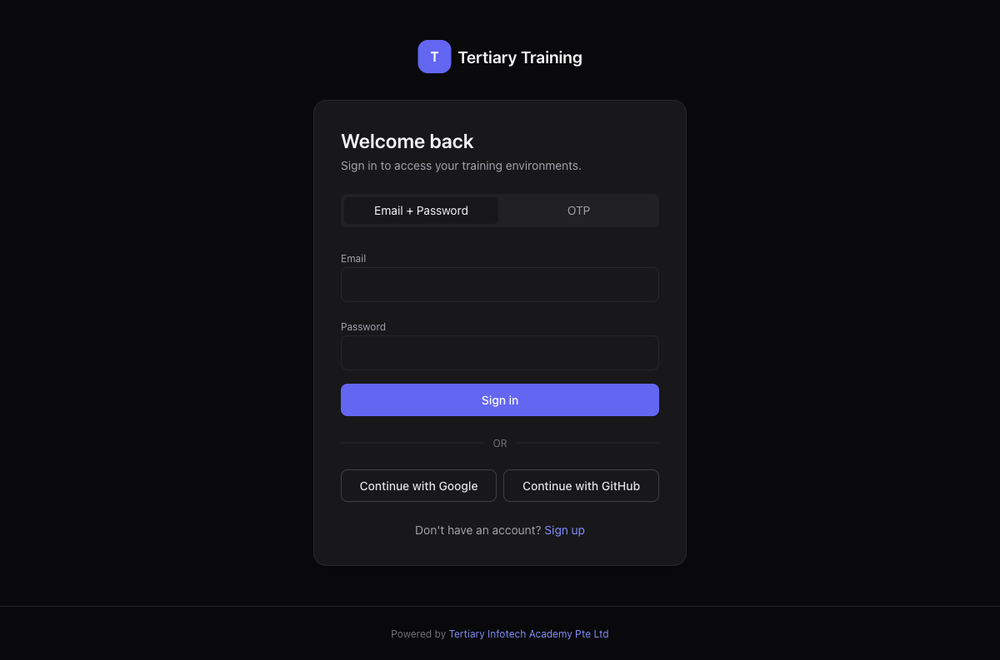

<div align="center">

# Tertiary Training

[](https://nextjs.org)
[](https://www.typescriptlang.org)
[](https://tailwindcss.com)
[](https://www.prisma.io)
[](https://www.postgresql.org)
[](https://www.docker.com)
[](https://coolify.io)

**Browser-based training environment management for Docker labs (WordPress, Ubuntu desktop, Kali Linux) — with role-based access, OAuth sign-in, on-demand container start/stop, and automatic idle shutdown.**

[Live Site](https://www.tertiarytraining.com) · [Report Bug](https://github.com/alfredang/tertiarytraining/issues) · [Request Feature](https://github.com/alfredang/tertiarytraining/issues)

</div>

## Screenshot



## About

**Tertiary Training** is a web platform that lets training centers spin up isolated, browser-accessible Docker lab environments for learners — without anyone needing SSH, local Docker, or a VM. Trainers and admins activate containers on demand; learners click a card and land in a working WordPress site, Ubuntu XFCE desktop, or Kali Linux desktop, all in a browser tab. Containers auto-shutdown after 2 hours of inactivity so a small VPS can serve many concurrent classes.

### Key features

| Area | What you get |
|---|---|
| **Three lab environments** | WordPress (5 demos), Ubuntu XFCE desktop (5 demos), Kali Linux desktop (5 demos) — all accessed via a real Let's Encrypt-secured `/lab/<env>-N/` reverse-proxy path |
| **Role-based access** | Learner / Trainer / Admin with explicit environment assignments. Admins have a "View as" topbar switcher to preview any role. |
| **Approval workflow** | New email/OAuth signups land in `PENDING`; admins and trainers approve/reject. Learner accounts have a configurable expiry window. |
| **OAuth + email login** | Sign in with Google or GitHub (credentials stored in admin Settings, no redeploy needed). Email/password still supported. |
| **On-demand containers** | Default state is STOPPED — zero idle RAM. Admin/trainer clicks Start → container boots in ~25s → access URL opens. Auto-stop after 2h. |
| **WordPress soft-reset** | Refresh a WP demo and the DB is restored from a "golden" SQL snapshot in ~1 second — admin credentials and sample content preserved, learner edits wiped. |
| **Daily disk hygiene** | A systemd timer prunes Docker image cache and build cache nightly without touching stopped containers or in-use volumes. |
| **Self-healing nginx** | The host nginx upstream IP auto-syncs after every Coolify rebuild via a 30-second timer — no manual `nginx -s reload` after deploys. |
| **In-app How-To guides** | Operator runbooks (Coolify CI/CD setup, WordPress admin login, refresh containers, enable Real Docker mode) live at `/how-to/*` and are visible to all roles. |

## Tech Stack

| Layer | Tools |
|---|---|
| **Frontend** | Next.js 16 (App Router), React 19, Tailwind CSS 3.4, TypeScript 5.7 |
| **Backend** | Next.js API routes, JWT sessions via `jose`, bcryptjs password hashing |
| **Database** | PostgreSQL 16, Prisma 5 ORM |
| **OAuth** | `arctic` (lightweight OAuth 2.0 + PKCE), Google + GitHub providers |
| **Docker control** | `dockerode` talks to `/var/run/docker.sock`; mock driver for local dev |
| **Lab containers** | `wordpress:latest` + `mariadb:11`, `lscr.io/linuxserver/webtop:ubuntu-xfce`, `lscr.io/linuxserver/kali-linux:latest` |
| **Hosting** | Coolify on a Hostinger VPS; host nginx + Let's Encrypt cert reverse-proxies everything |

## Architecture

```
                                Internet (HTTPS, Let's Encrypt cert)
                                                 │
                                                 ▼
        ┌──────────────────────────  host nginx :443  ──────────────────────────┐
        │                                                                       │
        │   /                       /lab/ubuntu-N/         /lab/kali-N/         │
        │   ↓                       ↓                      ↓                    │
        │   Coolify app container   127.0.0.1:809{1..5}    127.0.0.1:809{6..0}  │
        │   (Next.js + Prisma)      ubuntu-demoN (XFCE)    kali-demoN (Kali)    │
        │   ↓                                                                   │
        │   /var/run/docker.sock ←── dockerode controls all containers          │
        │   ↓                                                                   │
        │   Postgres (Coolify resource) — users, environments, container state  │
        │                                                                       │
        │   Also on host: 5 × (wordpress-demoN + db), n8n stack (untouched)    │
        └───────────────────────────────────────────────────────────────────────┘

                          systemd timers running on the host:
                          • tt-nginx-sync       (every 30s — fix upstream IP)
                          • tt-cleanup-idle     (every 5min — auto-stop idle)
                          • tt-docker-prune     (daily 03:00 — disk hygiene)
```

## Project Structure

```
tertiarytraining/
├── prisma/
│   ├── schema.prisma                  # User, Environment, DockerContainer, Assignment, RefreshLog, SystemSetting
│   └── migrations/                    # incremental migrations
├── src/
│   ├── app/
│   │   ├── login/                     # email + OAuth login with signup popup
│   │   ├── dashboard/{learner,trainer,admin}/
│   │   ├── admin/                     # users, envs, containers, refresh-logs, settings
│   │   ├── how-to/                    # operator runbooks
│   │   └── api/
│   │       ├── auth/                  # login, signup, OAuth start/callback (google + github)
│   │       ├── containers/[id]/       # start, stop, access, refresh
│   │       ├── admin/                 # approve, extend, settings, cleanup-idle
│   │       └── users/                 # CRUD + per-user env assignments
│   ├── components/                    # DashboardShell, EnvironmentCard, SettingsForm, …
│   └── lib/
│       ├── auth.ts                    # JWT session helpers
│       ├── docker.ts                  # DockerService (mock + dockerode) + WP soft-reset
│       ├── refresh.ts                 # refresh orchestration
│       ├── oauth.ts                   # arctic-based providers
│       └── settings.ts                # SystemSetting CRUD + OAuth cred storage
├── scripts/
│   ├── tt-ubuntu-bootstrap.sh         # provisions 5 webtop:ubuntu-xfce containers
│   ├── tt-kali-bootstrap.sh           # provisions 5 kali-linux containers
│   ├── tt-nginx-labs-apply.sh         # writes the lab proxy nginx vhost
│   └── tt-wp-bootstrap.sh             # captures WordPress golden SQL snapshots
├── Dockerfile                          # multi-stage Next.js standalone build
└── docker-compose.yml                  # local dev stack (Postgres + app)
```

## Getting Started

### Prerequisites

- Node.js 20+
- Docker + Docker Compose (for local Postgres)
- An OAuth client at Google Cloud Console and/or GitHub (optional — email login works without)

### Local development

```bash
git clone https://github.com/alfredang/tertiarytraining.git
cd tertiarytraining

cp .env.example .env
# Edit .env: set JWT_SECRET (`openssl rand -hex 32`) and SEED_TOKEN

# Start a local Postgres
docker run -d --name tertiary-db \
  -e POSTGRES_USER=postgres -e POSTGRES_PASSWORD=postgres \
  -e POSTGRES_DB=tertiary_training \
  -p 5433:5432 postgres:16-alpine

# Install deps, run migrations, start the dev server
npm install
npx prisma migrate dev
npx tsx scripts/seed-admins.ts          # creates 2 sample admin accounts
npx tsx scripts/seed-local-containers.ts # mirrors production env + container layout
npm run dev
```

Open [http://localhost:3000](http://localhost:3000), sign in with the seeded admin (`admin@tertiary.local` / `ChangeMe123!` — change immediately).

## Deployment

### Coolify (recommended)

The production deployment is on Coolify. Two resources:

| Resource | What |
|---|---|
| **Database** | Coolify-managed PostgreSQL 16 |
| **Application** | This repo, Build Pack: `Dockerfile`, Port: `3000` |

Environment variables on the Application resource:

```env
DATABASE_URL=postgres://…@…/postgres?schema=public
JWT_SECRET=<openssl rand -hex 32>
SEED_TOKEN=<openssl rand -hex 32>
DOCKER_HOST_MODE=dockerode              # or "mock"
PUBLIC_BASE_URL=https://www.tertiarytraining.com
NEXT_PUBLIC_APP_NAME=Tertiary Training
```

Custom Docker options (required for `dockerode` mode and lab restoration):

```
--volume /var/run/docker.sock:/var/run/docker.sock
--volume /opt/tertiarytraining/wp-golden:/opt/tertiarytraining/wp-golden:ro
```

Each branch push to `main` auto-deploys via a Coolify GitHub webhook. See [`/how-to/setup-coolify-cicd`](https://www.tertiarytraining.com/how-to/setup-coolify-cicd) for the wiring.

### Lab containers on the host

After the app is up, SSH to the host and run the bootstrap scripts once:

```bash
sudo /usr/local/bin/tt-ubuntu-bootstrap.sh   # 5 Ubuntu XFCE desktops on 8091..8095
sudo /usr/local/bin/tt-kali-bootstrap.sh     # 5 Kali Linux desktops on 8096..8100
sudo /usr/local/bin/tt-wp-bootstrap.sh       # captures WP golden DB snapshots
sudo /usr/local/bin/tt-nginx-labs-apply.sh   # adds the /lab/* proxy locations to nginx
```

Full setup walk-through inside the app at [`/how-to/enable-real-docker`](https://www.tertiarytraining.com/how-to/enable-real-docker).

### Docker Compose (local end-to-end stack)

```bash
JWT_SECRET=$(openssl rand -hex 32) docker compose up --build
```

## Contributing

1. Fork the repo
2. Create a feature branch: `git checkout -b feature/your-feature`
3. Make changes; the codebase ships with a TypeScript-checked build (`npm run build`) which is what production runs
4. Commit: `git commit -m "feat: describe change"`
5. Push: `git push origin feature/your-feature`
6. Open a Pull Request

Issues, ideas, and discussions: [GitHub Issues](https://github.com/alfredang/tertiarytraining/issues).

## Developed By

[**Tertiary Infotech Academy Pte. Ltd.**](https://www.tertiarycourses.com.sg) — training centre in Singapore. This codebase powers internal labs for hands-on classes (WordPress, Linux, security training).

## Acknowledgements

- [Next.js](https://nextjs.org/) for the App Router framework
- [Prisma](https://www.prisma.io/) for the type-safe ORM
- [Coolify](https://coolify.io/) for the self-hosted PaaS
- [linuxserver.io](https://www.linuxserver.io/) for the `webtop` and `kali-linux` desktop images
- [arctic](https://arcticjs.dev/) for the lightweight OAuth helpers
- [tsl0922/ttyd](https://github.com/tsl0922/ttyd) — research for early terminal-only Ubuntu lab
- [WP-CLI](https://wp-cli.org/) for the WordPress install + golden-snapshot tooling

---

<div align="center">

If this project saved you setup time, **⭐ star the repo** — it helps others discover it.

</div>
